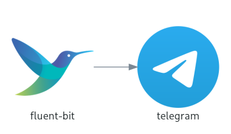

# FLB output plugin for Telegram

FluentBit output plugin for Telegram



## FluentBit OUTPUT Params

| param name           | default            | description                    | example               | mandatory |
|----------------------|--------------------|--------------------------------|-----------------------|-----------|
| Name                 | telegram           | pulgin name (fixed)            |                       | yes       |
| api_token            |                    | telegram api token             | YOUR_API_KEY          | yes       |
| room_ids             |                    | comma seperated room ids       | 1111111111,2222222222 | yes       |
| message_key          | message            | key for message to send        | cpu_p                 | no        |
| timestamp_layout     | 20060102T15:04:05Z | Go timestamp layout            | 060102-150405         | no        |
| timestamp_location   | UTC                | timestamp in specific timezone | Asia/Seoul            | no        |
| optional_keys        |                    | optional keys to send          | level,hostname        | no        |
| suppress_duplication | no                 | suppress duplicated messages   | yes,on,true                   | no        |
| floor_float          | no                 | floor float value              | yes,on,true                   | no        |

## Build and Run

Build docker image `flb-tg` which is Telegram enabled fluent-bit image:

```bash
docker buildx build \
  --platform linux/amd64 \
  --tag=flb-tg:latest \
  .
```

Run example:

```bash
docker run \
  -it --rm \
  -e TG_API_TOKEN="YOUR_TELEGRAM_API_TOKEN"
  -e TG_ROOM_IDS="ROOM_ID1, ROOM_ID2"
  flb-tg:latest
```

## Configuration

Check out [sample conf file](conf/flb.conf).
Make your own conf and run like this:

```bash
docker run \
  -it --rm \
  -e TG_API_TOKEN="YOUR_TELEGRAM_API_TOKEN"
  -e TG_ROOM_IDS="ROOM_ID1, ROOM_ID2"
  -v /YOUR/FLB_CONF_PATH:/conf/flb.conf
  flb-tg:latest
```

## Reference

- <https://docs.fluentbit.io/manual/>
